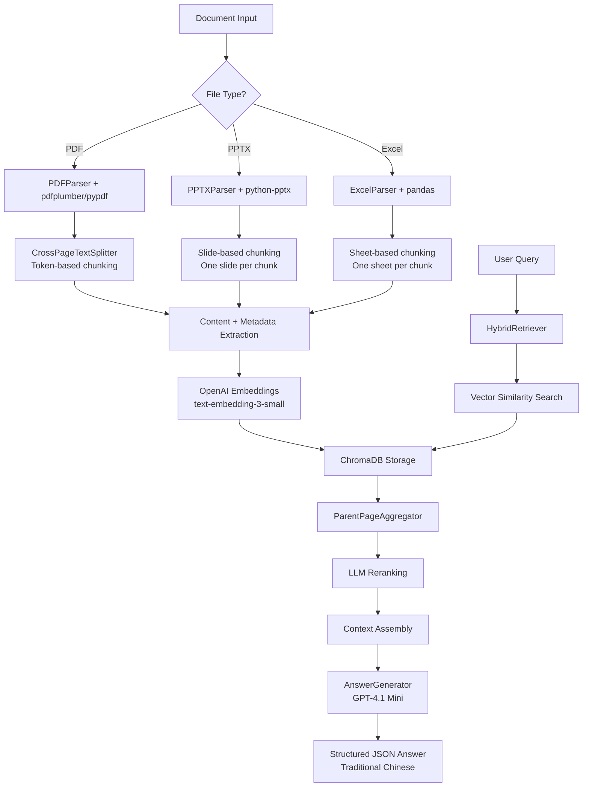
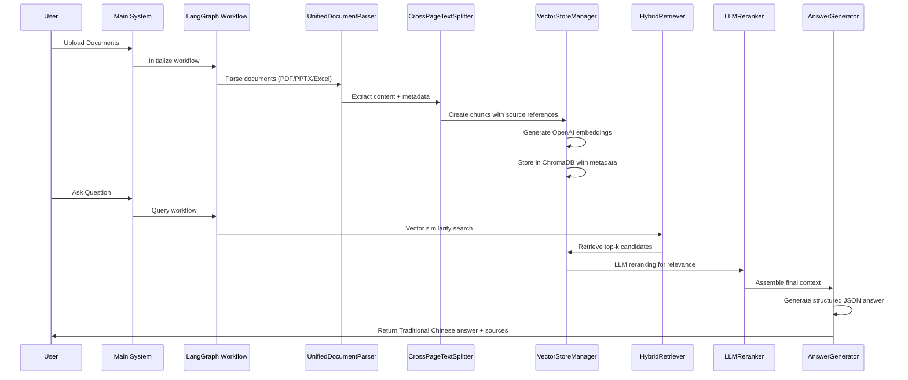

# RAG System 

A robust, maintainable Retrieval-Augmented Generation (RAG) system that processes multiple document formats (PDF, PowerPoint, Excel) and provides accurate question-answering with proper source citations in Traditional Chinese.

## Features

- **Multi-format document processing**: PDF, PPTX, and Excel files
- **Intelligent chunking strategies**: 
  - PPTX: One slide per chunk
  - Excel: One sheet per chunk  
  - PDF: Token-based chunking with cross-page awareness
- **Accurate source referencing**: Citations in format "filename (Slide X)" or "filename (Page X)"
- **Vector-based retrieval**: Uses ChromaDB with OpenAI embeddings for efficient similarity search
- **LLM integration**: GPT-4.1 Mini for answer generation with structured JSON output
- **Configuration-driven**: No hardcoded values, all settings in config.py
- **Traditional Chinese responses**: Financial report assistant optimized for Traditional Chinese output

## Architecture



## System Workflow



## Installation

### Prerequisites

- Python 3.10 or higher
- Conda package manager
- OpenAI API key

### Setup

1. **Clone or download the project**:
   ```bash
   cd /path/to/ragv1
   ```

2. **Create and activate conda environment**:
   ```bash
   conda create -n ragv2 python=3.10
   conda activate ragv2
   ```

3. **Install dependencies**:
   ```bash
   pip install -r requirements.txt
   ```

4. **Configure environment variables**:
   Create a `.env` file in the project root:
   ```env
   OPENAI_API_KEY=your_openai_api_key_here
   # Optional: Enable telemetry (disabled by default)
   ENABLE_TELEMETRY=false
   ```

## Configuration

All system configuration is managed in `config.py`. Key settings include:

### Model Configuration
```python
DEFAULT_LLM_MODEL = "gpt-4.1-mini"           # Main generation model
DEFAULT_EMBEDDING_MODEL = "text-embedding-3-small"  # Vector embeddings
```

### Chunking Configuration
```python
DEFAULT_CHUNK_SIZE = 400          # Token-based chunk size for PDFs
DEFAULT_CHUNK_OVERLAP = 100       # Overlap between chunks
```

### Retrieval Configuration
```python
DEFAULT_TOP_K = 30               # Initial vector search results
DEFAULT_TOP_N = 10               # Final reranked results
DEFAULT_LLM_WEIGHT = 0.7         # LLM reranking weight
DEFAULT_BATCH_SIZE = 2           # Batch size for LLM reranking
```

### Vector Database Configuration
```python
DEFAULT_VECTORSTORE_DIR = "chromadb_test"   # ChromaDB storage directory
```

## Usage

### Basic Usage

```bash
# Activate the environment
conda activate ragv1

# Interactive mode - ask questions interactively
python main.py

# Command line mode - single question
python main.py "What are the financial highlights for Q1?"
```

### Document Processing

The system automatically processes documents based on their file extensions:

- **PDF files**: 
  - Uses pdfplumber (primary) and pypdf (fallback)
  - Token-based chunking with cross-page awareness
  - Layout-aware text extraction with multi-column support
  - Page number tracking for citations

- **PowerPoint files (.pptx)**: 
  - Extracts slide content using python-pptx
  - One slide per chunk approach
  - Slide number tracking for precise citations
  - Preserves slide structure and formatting

- **Excel files (.xlsx, .xls)**: 
  - Processes using pandas and openpyxl/xlrd
  - One sheet per chunk strategy
  - Sheet name preservation for citations
  - Handles multiple workbook sheets independently

### Query Processing and Output

The system provides structured responses in Traditional Chinese with:

1. **Step-by-step analysis**: Detailed reasoning process
2. **Reasoning summary**: Concise evidence synthesis  
3. **Relevant sources**: Source citations used in the answer
4. **Confidence level**: high/medium/low confidence assessment
5. **Final answer**: Traditional Chinese response with proper financial formatting

Example interaction:
```
Question: 2023年第一季的毛利是多少？
Answer: 2023年第一季（1Q23）毛利為314,505百萬元新台幣（314,505,000,000元）。

--- Sources ---
  1. excel_FS-Consolidated_1Q25.xls (Page 5)
```

## File Structure

```
ragv1/
├── main.py                 # Main entry point and CLI interface
├── config.py              # System configuration and settings
├── parsing.py             # Document parsing (PDF/PPTX/Excel)
├── chunking.py            # Content chunking with cross-page support  
├── vectorstore.py         # ChromaDB vector database operations
├── retrieval.py           # Hybrid retrieval with LLM reranking
├── generation.py          # Answer generation with structured output
├── workflow.py            # LangGraph workflow orchestration
├── models.py              # Pydantic data models and schemas
├── prompts.py             # LLM prompt templates and schemas
├── utils.py               # Utility functions and helpers
├── requirements.txt       # Python dependencies
├── README.md              # This documentation
├── .env                   # Environment variables (create this)
├── qa_log.csv             # Query and answer logs
└── chromadb_test/         # ChromaDB vector database storage
```

## Technical Details

### Chunking Strategies

1. **PDF Documents**:
   - Uses `CrossPageTextSplitter` with RecursiveCharacterTextSplitter
   - Token-based chunking (400 tokens) with 100-token overlap
   - Cross-page boundary awareness for semantic continuity
   - Layout-aware extraction with multi-column support
   - Page markers for accurate source tracking

2. **PowerPoint Presentations**:
   - One slide per chunk approach using python-pptx
   - Extracts slide titles, content, and notes
   - Preserves slide number for citation format "filename (Slide X)"
   - Handles text boxes, shapes, and slide layouts

3. **Excel Spreadsheets**:
   - Sheet-level chunking using pandas
   - Complete sheet content as single semantic unit
   - Preserves sheet names for citation format "filename Sheet: SheetName"
   - Supports both .xlsx (openpyxl) and .xls (xlrd) formats

### Vector Storage and Retrieval

- **Embedding Model**: OpenAI text-embedding-3-small (1536 dimensions)
- **Vector Database**: ChromaDB with SQLite backend for local persistence
- **Content Strategy**: Only document content is embedded, metadata stored separately
- **Retrieval Pipeline**: 
  1. Vector similarity search (top-30 candidates)
  2. Parent page aggregation for context recovery
  3. LLM reranking using GPT-4 Turbo Mini (top-10 final results)
  4. Context assembly with source tracking

### Answer Generation

- **Model**: GPT-4.1 Mini (gpt-4.1-mini) with 0.3 temperature
- **Output Format**: Structured JSON with Pydantic schema validation
- **Language**: Traditional Chinese optimized for financial reports
- **Response Structure**:
  - `step_by_step_analysis`: Detailed reasoning process
  - `reasoning_summary`: Evidence synthesis
  - `relevant_sources`: Source citations
  - `confidence_level`: Assessment (high/medium/low)
  - `final_answer`: Traditional Chinese response

### Source Citation Format

The system enforces consistent source citation formats:
- PowerPoint slides: `filename (Slide X)`
- PDF pages: `filename (Page X)`  
- Excel sheets: `filename Sheet: SheetName`

## Performance and Monitoring

### Logging and Metrics

The system automatically logs:
- Query and answer pairs
- Performance metrics (retrieval time, generation time, token usage)
- Confidence levels and source citations
- Retrieval relevance scores

### Performance Optimization

**Recommended Settings:**
- Chunk size: 400 tokens for optimal context vs. specificity balance
- Top-K retrieval: 30 candidates for comprehensive coverage
- Top-N final: 10 results after LLM reranking
- LLM weight: 0.7 for balanced vector-LLM ranking

**Scaling Considerations:**
- ChromaDB handles thousands of documents efficiently
- Batch processing available for large document collections
- Vector search optimized with proper indexing
- LLM reranking batching to control API costs

## Troubleshooting

### Common Issues

1. **Missing API Key**:
   ```
   Error: Please set OPENAI_API_KEY in your .env file
   Solution: Create .env file with valid OpenAI API key
   ```

2. **Import Errors**:
   ```
   Error: Module not found
   Solution: Ensure conda environment is activated and run pip install -r requirements.txt
   ```

3. **Database Errors**:
   ```
   Error: ChromaDB connection failed
   Solution: Check chromadb_test directory permissions, delete and recreate if corrupted
   ```

4. **Document Parsing Errors**:
   ```
   Error: Failed to parse document
   Solution: Check file format support (PDF/PPTX/Excel) and file integrity
   ```

### Debug Mode

Enable detailed logging by modifying config.py:
```python
import logging
logging.basicConfig(level=logging.DEBUG)
```

For telemetry and detailed ChromaDB logs:
```env
ENABLE_TELEMETRY=true
```

## System Requirements

### Dependencies
- **LangChain**: 0.3.27+ (core RAG framework)
- **LangGraph**: 0.6.4+ (workflow orchestration)  
- **OpenAI**: 1.99.6+ (LLM and embeddings)
- **ChromaDB**: 1.0.16+ (vector database)
- **Document Processing**: pypdf, pdfplumber, python-pptx, pandas, openpyxl
- **Python**: 3.10+ (required for all dependencies)

### Hardware Recommendations
- **Memory**: 8GB+ RAM for large document collections
- **Storage**: SSD recommended for ChromaDB performance
- **Network**: Stable internet for OpenAI API calls


### Development Workflow

1. Make changes in feature branches
2. Test with various document formats (PDF/PPTX/Excel)
3. Verify source citations are properly formatted
4. Run integration tests with sample documents
5. Update documentation for any configuration changes


## Support

For technical support:
1. Check the troubleshooting section above
2. Review configuration settings in config.py
3. Check system logs (qa_log.csv) for error patterns
4. Verify document formats are supported
5. Test with sample documents to isolate issues
