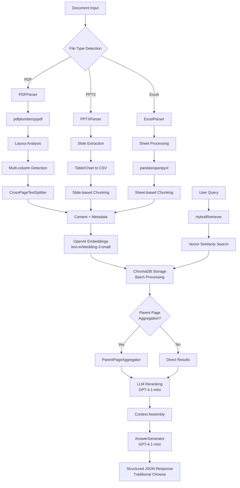
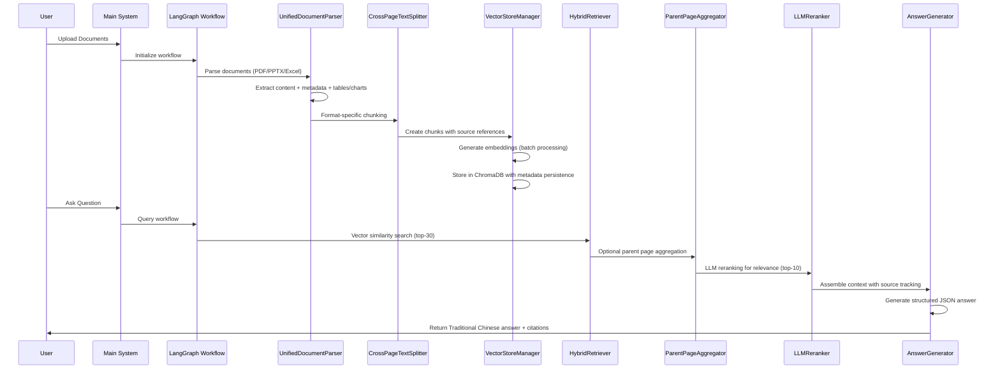

# RAG System

A Retrieval-Augmented Generation system designed for multi-format document processing and intelligent question answering. Built with **LangChain** and **LangGraph** frameworks, this system runs entirely on **CPU-only environments** while leveraging OpenAI's API for embeddings and language generation.

## System Overview

**Supported Document Formats:**
- **PDF**: Advanced layout analysis with multi-column detection and cross-page chunking
- **PowerPoint (PPTX/PPT)**: Slide content extraction with table/chart data conversion
- **Excel (XLSX/XLS)**: Complete spreadsheet processing with sheet-level analysis

**Language Support:**
- **Primary**: Traditional Chinese (繁體中文) with specialized financial terminology
- **Secondary**: English content processing and technical term handling
- **Mixed Content**: Bilingual document support with language-aware processing

**Technical Framework:**
- **Core**: LangChain ecosystem for document processing and retrieval
- **Orchestration**: LangGraph for workflow management and state coordination
- **Vector Database**: ChromaDB for local vector storage and similarity search
- **Embeddings**: OpenAI text-embedding-3-small for semantic understanding
- **Generation**: GPT-4.1-mini for structured answer generation

**Infrastructure Requirements:**
- **CPU Only**: No GPU requirements - runs on standard server or desktop hardware
- **Local Storage**: ChromaDB provides local vector database persistence
- **API Integration**: OpenAI API for embeddings and language model capabilities
- **Scalable**: Handles large document collections with batch processing optimization

The system specializes in Traditional Chinese financial report analysis with advanced document parsing, vector-based retrieval, and structured answer generation.

## Features

- **Multi-format Document Processing**: Robust parsing for PDF, PowerPoint (PPTX), and Excel files with format-specific optimization
- **Advanced PDF Analysis**: Layout-aware text extraction with multi-column detection and cross-page chunking
- **Structured Data Extraction**: PPTX tables and charts converted to CSV format for enhanced data comprehension
- **Intelligent Chunking**: Format-adaptive strategies (slide-per-chunk for PPTX, sheet-per-chunk for Excel, token-based for PDF)
- **Hybrid Retrieval System**: Vector similarity search combined with LLM reranking for optimal relevance
- **Parent Page Aggregation**: Intelligent content matching for accurate source attribution
- **Vector Database Persistence**: ChromaDB with batch processing and metadata recovery
- **Structured JSON Output**: Pydantic-validated responses with confidence assessment
- **Traditional Chinese Support**: Optimized for Traditional Chinese financial report analysis
- **Performance Monitoring**: Comprehensive logging with token usage and throughput metrics

## Architecture



## System Workflow



## Installation

### Prerequisites

- Python 3.10 or higher
- Conda package manager
- OpenAI API key with GPT-4.1-mini and embedding model access

### Environment Setup

1. **Create conda environment**:
   ```bash
   conda create -n ragv2 python=3.10
   conda activate ragv2
   ```

2. **Navigate to project directory**:
   ```bash
   cd /path/to/your/ragv2-project
   ```

3. **Install dependencies**:
   ```bash
   pip install -r requirements.txt
   ```

4. **Configure environment variables**:
   Create a `.env` file in the project root:
   ```env
   OPENAI_API_KEY=your_openai_api_key_here
   ENABLE_TELEMETRY=false
   ```

## Configuration

The system configuration is centrally managed in `config.py`. Key parameters:

### Model Configuration
```python
DEFAULT_LLM_MODEL = "gpt-4.1-mini"                  # Answer generation model
DEFAULT_EMBEDDING_MODEL = "text-embedding-3-small"  # Vector embeddings
```

### Chunking Parameters
```python
DEFAULT_CHUNK_SIZE = 400          # Token-based chunk size for PDFs
DEFAULT_CHUNK_OVERLAP = 100       # Overlap between adjacent chunks
```

### Retrieval Configuration
```python
DEFAULT_TOP_K = 30               # Initial vector search results
DEFAULT_TOP_N = 10               # Final reranked results for context
DEFAULT_LLM_WEIGHT = 0.7         # LLM reranking weight (vs vector similarity)
DEFAULT_BATCH_SIZE = 2           # Batch size for LLM reranking
```

### Vector Database
```python
DEFAULT_VECTORSTORE_DIR = "chromadb_test"   # ChromaDB storage directory
PARENT_PAGE_AGGREGATOR = True              # Enable parent page aggregation
```

### Supported File Types
```python
SUPPORTED_EXTENSIONS = ['.pdf', '.pptx', '.ppt', '.xls', '.xlsx']
```

## Usage

### Basic Operation

```bash
# Activate environment
conda activate ragv2

# Interactive mode - continuous question answering
python main.py

# Command line mode - single question
python main.py "What are the quarterly revenue figures?"
```

### Document Processing Workflow

The system automatically handles document processing based on file extensions:

#### PDF Documents
- **Parser**: pdfplumber (primary) with pypdf fallback
- **Layout Analysis**: Automatic multi-column detection and coordinate-based extraction
- **Chunking Strategy**: Token-based with cross-page awareness (400 tokens, 100 overlap)
- **Special Features**: 
  - Table extraction and formatting
  - Layout-preserved text extraction
  - Column-aware processing for multi-column layouts
- **Citation Format**: `filename.pdf (Page X)`

#### PowerPoint Presentations (.pptx)
- **Parser**: python-pptx with structured data conversion
- **Content Extraction**: Slide text, titles, tables, and charts
- **Chunking Strategy**: One slide per chunk approach
- **Special Features**:
  - Tables converted to CSV format for better understanding
  - Charts converted to CSV with data series extraction
  - Structured data processed with ExcelParser methodology
- **Citation Format**: `filename.pptx (Slide X)`

#### Excel Spreadsheets (.xlsx, .xls)
- **Parser**: pandas with openpyxl/xlrd engines
- **Content Processing**: All sheets with complete data preservation
- **Chunking Strategy**: One sheet per chunk (complete semantic units)
- **Special Features**:
  - Maintains data relationships and formatting
  - Sheet name preservation for precise citations
  - Structured data prioritization for financial queries
- **Citation Format**: `filename.xlsx Sheet: SheetName`

### Query Processing and Output Structure

The system provides comprehensive structured responses in Traditional Chinese:

#### Response Schema
```json
{
  "step_by_step_analysis": "Detailed analytical reasoning process",
  "reasoning_summary": "Concise evidence synthesis highlighting key findings",
  "relevant_sources": ["Exact source citations used in analysis"],
  "confidence_level": "high|medium|low",
  "final_answer": "Traditional Chinese response with financial formatting"
}
```

#### Financial Data Handling
- **Currency**: All amounts displayed in New Taiwan Dollar (元)
- **Number Formatting**: Includes Chinese numeric reading in parentheses
  - Example: 153,575,000,000 元 (1千5百3十5億7千5百萬元)
- **Data Prioritization**: Excel sheets prioritized over PDFs for financial queries
- **Source Tracking**: Precise citation with page/slide/sheet references

### Example Interaction
```
Question: 2023年第一季的營收是多少？

Response:
{
  "step_by_step_analysis": "根據提供的財務報表資料，我需要查找2023年第一季（1Q23）的營收數據...",
  "reasoning_summary": "從Excel財務報表中找到2023年第一季營收數據",
  "relevant_sources": ["financial_report_Q1_2023.xlsx Sheet: Income Statement"],
  "confidence_level": "high",
  "final_answer": "2023年第一季營收為1,405,839,000,000元（1兆4千零5十8億3千9百萬元）。"
}
```

## File Structure

```
ragv2/
├── main.py                # Main entry point and CLI interface
├── config.py              # System configuration and parameters
├── parsing.py             # Multi-format document parsing (PDF/PPTX/Excel)
├── chunking.py            # Content chunking with cross-page support
├── vectorstore.py         # ChromaDB vector database management
├── retrieval.py           # Hybrid retrieval with LLM reranking
├── generation.py          # Structured answer generation
├── workflow.py            # LangGraph workflow orchestration
├── models.py              # Pydantic data models and schemas
├── prompts.py             # LLM prompt templates and instructions
├── utils.py               # Utility functions and helpers
├── requirements.txt       # Python dependencies
├── .env                   # Environment variables (create this)
├── README.md              # Project documentation
├── qa_log.csv             # Query and answer logs with metrics
└── chromadb_test/         # ChromaDB vector database storage
```

## Technical Implementation

### Advanced PDF Processing
- **Layout Analysis**: Coordinate-based column detection with gap analysis
- **Multi-column Support**: Automatic column boundary detection and separate processing
- **Cross-page Chunking**: Semantic continuity across page boundaries
- **Table Extraction**: Structured table data with formatting preservation
- **Fallback Mechanisms**: Multiple extraction methods for robust parsing

### Vector Storage Architecture
- **Embedding Model**: OpenAI text-embedding-3-small (1536 dimensions)
- **Database**: ChromaDB with SQLite backend for local persistence
- **Batch Processing**: Handles large document collections with token limit management
- **Metadata Recovery**: Document structure preservation for system reconstruction
- **Content Strategy**: Text content vectorized, metadata stored separately

### Retrieval Pipeline
1. **Vector Similarity Search**: Initial candidate retrieval (top-30)
2. **Parent Page Aggregation**: Intelligent content matching for accurate attribution (PDF only)
3. **LLM Reranking**: GPT-4.1-mini relevance scoring with batch processing (top-10)
4. **Context Assembly**: Source-tracked context with proper citations

### Answer Generation
- **Model**: GPT-4.1-mini with 0.3 temperature for balanced creativity/accuracy
- **Output Validation**: Pydantic schema enforcement with fallback parsing
- **Language Optimization**: Traditional Chinese financial terminology
- **Error Handling**: Multiple parsing strategies with graceful degradation

## Performance and Monitoring

### Logging and Metrics
Automatic comprehensive logging includes:
- **Query Metrics**: Question, answer, confidence level, source usage
- **Performance Data**: Retrieval time, generation time, token usage, throughput
- **Retrieval Analytics**: Relevance scores, result counts, ranking effectiveness
- **System Health**: Vector database statistics, processing success rates

### Performance Optimization

#### Recommended Configuration
- **Chunk Size**: 400 tokens (optimal balance of context vs specificity)
- **Retrieval Parameters**: 30 initial candidates, 10 final results
- **LLM Weight**: 0.7 (balanced vector-LLM ranking)
- **Batch Size**: 2 for reranking (API efficiency vs latency)

#### Scaling Considerations
- **Document Capacity**: ChromaDB efficiently handles thousands of documents
- **Memory Usage**: 8GB+ RAM recommended for large collections
- **Storage**: SSD recommended for optimal ChromaDB performance
- **API Efficiency**: Batch processing and connection pooling for OpenAI API

### Hardware Recommendations
- **Memory**: 8GB+ RAM for large document collections
- **Storage**: SSD for ChromaDB performance optimization
- **Network**: Stable internet connection for OpenAI API calls
- **CPU**: Multi-core processor for concurrent document processing

## Troubleshooting

### Common Issues and Solutions

#### Environment Setup
```bash
# Missing API Key
Error: Please set OPENAI_API_KEY in your .env file
Solution: Create .env file with valid OpenAI API key

# Import Errors
Error: Module not found
Solution: Ensure conda environment activated: conda activate ragv2
         Then: pip install -r requirements.txt

# Permission Issues
Error: Permission denied accessing chromadb_test/
Solution: Check directory permissions or delete and recreate
```

#### Document Processing
```bash
# PDF Parsing Failures
Error: Both PDF extraction methods failed
Solution: Check file integrity, try different PDF files
         Ensure pdfplumber and pypdf dependencies installed

# Excel Format Issues
Error: Failed to parse Excel file
Solution: Verify file format (.xlsx/.xls), check for corruption
         Ensure openpyxl and xlrd packages installed

# PowerPoint Extraction
Error: PPTX parsing failed
Solution: Check file format (.pptx), ensure python-pptx installed
         Verify presentation contains extractable content
```

#### Vector Database Issues
```bash
# Database Corruption
Error: ChromaDB connection failed
Solution: Delete chromadb_test directory and recreate
         Check disk space and permissions

# Embedding Failures
Error: OpenAI embedding request failed
Solution: Check API key validity and rate limits
         Verify internet connection stability

# Memory Issues
Error: Out of memory during embedding
Solution: Reduce batch size in vectorstore.py
         Process documents in smaller batches
```

### Debug Mode
Enable detailed logging by setting environment variables:
```bash
export ENABLE_TELEMETRY=true
export CHROMA_TELEMETRY=true
```

Or modify `config.py`:
```python
import logging
logging.basicConfig(level=logging.DEBUG)
```

### Performance Diagnostics
- **Token Usage**: Monitor qa_log.csv for token consumption patterns
- **Retrieval Quality**: Check relevance scores and confidence levels
- **System Resources**: Monitor memory usage during large document processing
- **API Efficiency**: Track throughput metrics and response times

## Support and Maintenance

### System Monitoring
1. **Regular Log Review**: Check qa_log.csv for performance trends
2. **Vector Database Health**: Monitor ChromaDB size and query performance
3. **Token Usage Tracking**: Review OpenAI API consumption patterns
4. **Document Processing**: Verify parsing success rates across file types

### Maintenance Tasks
1. **Database Cleanup**: Periodic chromadb_test directory optimization
2. **Log Rotation**: Archive or clean qa_log.csv files
3. **Dependency Updates**: Regular package updates with compatibility testing
4. **Configuration Tuning**: Adjust parameters based on usage patterns

### Development Guidelines
1. **Testing**: Verify functionality with diverse document formats
2. **Source Citations**: Ensure proper formatting across all document types
3. **Performance**: Monitor and optimize for document collection size
4. **Language Support**: Maintain Traditional Chinese accuracy and terminology
